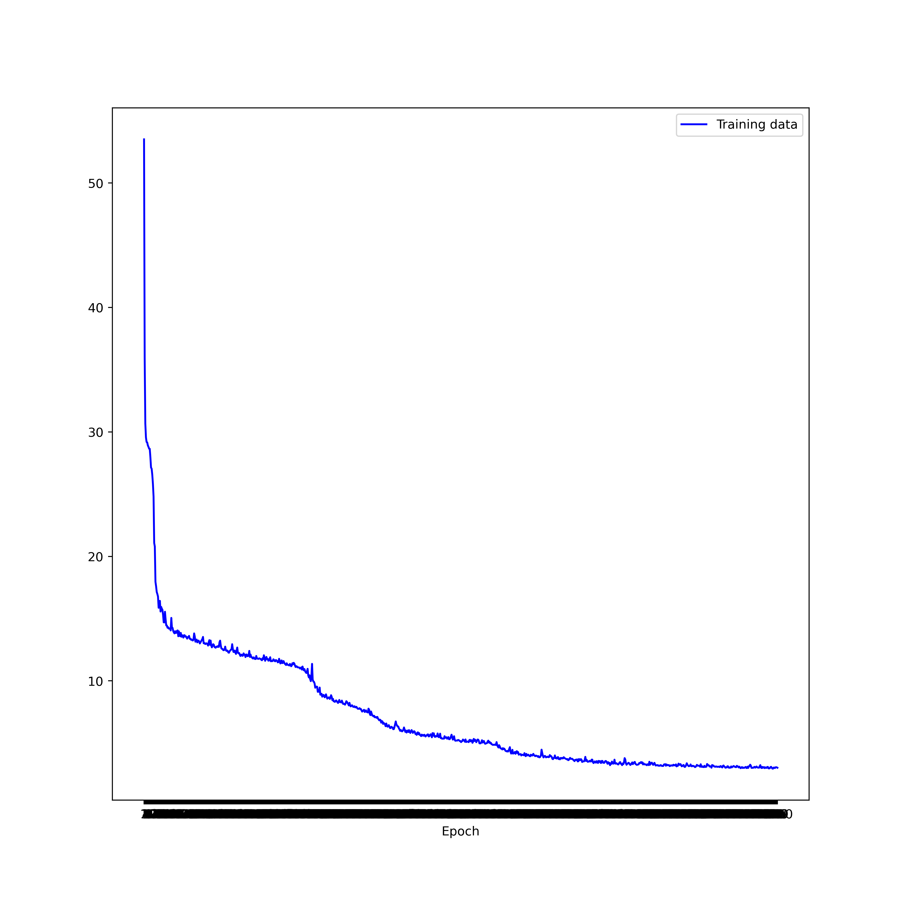

## PoseNet Model by PyTorch 

This model is implemented based on PoseNet architecture proposed in the ICCV 2015 paper **PoseNet: A Convolutional Network for Real-Time 6-DOF Camera Relocalization** by Alex Kendall, Matthew Grimes and Roberto Cipolla [http://mi.eng.cam.ac.uk/projects/relocalisation/]

## Quick Start
### Dependencies and Environment
- PyTorch >= 0.4.0
- Numpy >= 1.15
- Python >=3.5.0
- KingsCollege Dataset [download](https://www.repository.cam.ac.uk/bitstream/handle/1810/251342/KingsCollege.zip) and extract it in the **data/datasets/** directory.
- download pretrained googlenet weights and place it in the **pretrained_models**
```python
wget https://vision.in.tum.de/webarchive/hazirbas/poselstm-pytorch/places-googlenet.pickle
```

### Train from scratch
```python
python train.py --epochs 200 --learning_rate 0.0001 --batch_size 75 --save_freq 20
```

### Evaluate with Your checkpoints
```python
python test.py --epochs 981 --batch_size 75
```

### Results
Epoch = 1000
Learning Rate = 0.0001
Batch Size = 75
Checkpoints = 981
#### Errors
| Median position error | Median orientation error |
| --------------------- | ------------------------ |
| 2.967 m               | 2.886 degrees            |

#### Training Losses

